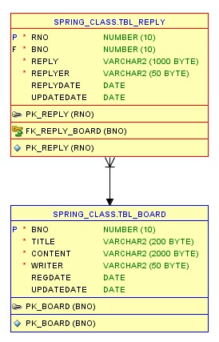
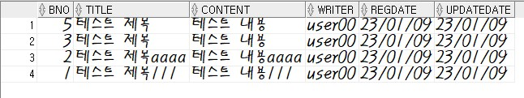
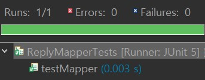
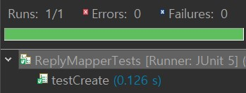
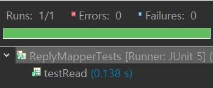
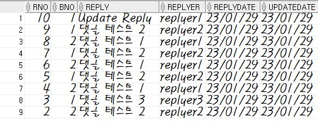
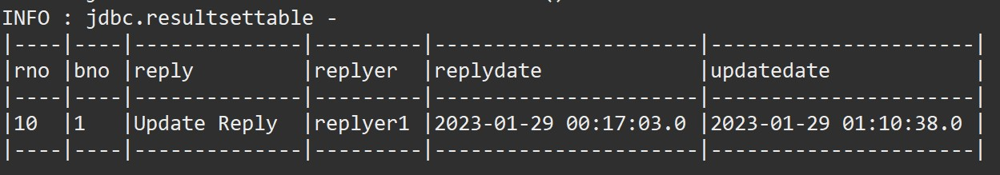
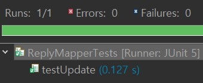

# **Project - REST & Ajax**  ♻️

 ## 💡 `Spring` PROJECT      


---

### 🧾 프로젝트 소개 

---

>**ECLIPSE 환경 구축**

> 1. ECLIPSE 설치
> 2. JDK 설치
> 3. Oracle 설치 
> 4. Tomcat 설치

###### Eclipse Marketplace
> 5. Spring Tools 3 Add-On for Spring Tools 4 [3.9.22.RELEASE] 설치
> 6. Eclipse Enterprise Java and Web Developer Tools 3.20 설치
 
---

### Ajax 댓글 처리

#### ◾ **initial source file upload** 
- ###### `/board/list`
database<br>
- CRUD 작업을 테스트하기 전에 tbl_reply 테이블이 tbl_board 테이블과 FK(외래키)의 관계로 처리되어 있다는 점을 알아두기<br>
<br>
- tbl_reply가 tbl_board 테이블의 bno 값과 정확히 일치해야 하므로 테스트 진행 전 최신 bno 번호 몇 개를 예제로 확인

```
SELECT * FROM tbl_board WHERE rownum < 10 ORDER BY bno DESC;
```

#### ◾ **testMapper** 
- src/test/java
    - org.zerock.mapper
        - ReplyMapperTests : testMapper()를 통해서 ReplyMapper 타입의 객체가 정상적으로 사용이 가능한지 확인<br>


---

#### CRUD 작업
#### ◾ **등록(create)** 
- TEST(게시물 번호의 일부로 실제 데이터베이스에 있는 번호 확인(PK - FK))<br>

- tbl_reply의 상태 확인<br>


```
SELECT * FROM tbl_reply ORDER BY rno DESC;
```

#### ◾ **조회(read)** 
- TEST(5번 댓글 조회)<br>



#### ◾ **삭제(delete)** 
- TEST(1번 삭제)<br>


#### ◾ **수정(update)** 
- TEST(10번 수정)<br>





---
